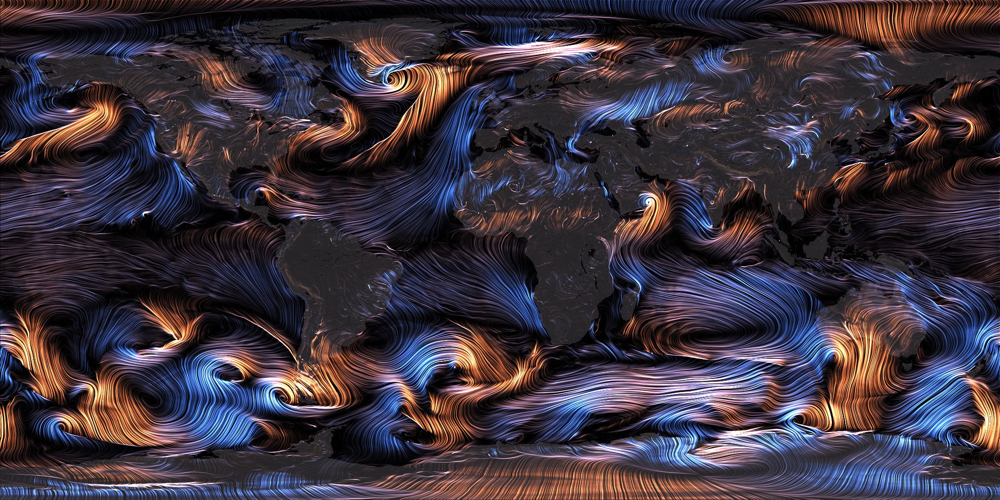

# majicweather

This is the source code for the C/C++ tool behind [majicweather.com](http://majicweather.com)

## Install

majicweather has been tested on macOS 10.13 and Ubuntu 16.04.4. It requires [ecCodes](https://software.ecmwf.int/wiki/display/ECC/ecCodes+Home) and if you want to decode WaveWatch III data, it also requires [openjpeg](https://github.com/uclouvain/openjpeg).

For macOS, there is an Xcode project in majicweather/xcode which should just work. It uses pre-built versions of ecCodes 2.7.3 and openjpeg 2.1.2.

For other platforms you will need to download and compile these libraries yourself, and edit the majicweather/CMakeLists.txt file as appropriate to find your built versions. When building ecCodes, you need to ensure that ecCodes has found the openjpeg libraries, and you'll also want to disable Fortran support to get it to build.

## Basic Usage

`majicweather -i inputGribFile -o outputJpgFile  -r resourcesDirectory`

resourcesDirectory is just the path to the 'resources' directory included with the source.

Run the binary without any arguments to see the other options, you can also specify the region and resolution of the output.

If you are using a WaveWatch III input file, also specify -O so it knows to look for swell instead of wind.

## Data

GFS data is available [here](http://www.nco.ncep.noaa.gov/pmb/products/gfs/) with archives available [here](https://www.ncdc.noaa.gov/data-access/model-data/model-datasets/global-forcast-system-gfs)

Wavewatch III data is available [here](http://polar.ncep.noaa.gov/waves/ensemble/download.shtml)

## Apologies

This is a hastily hacked together project. I've open sourced it because I'm very interested in this kind of data visualization, and I'd like to see what else people might come up with. The code is very specific to its purpose, and there would be quite a bit of work involved to make this a more general purpose weather visualization tool. But hopefully it's useful as a starting point for someone.